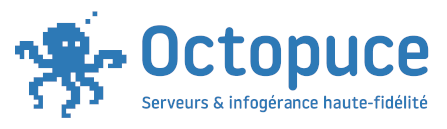
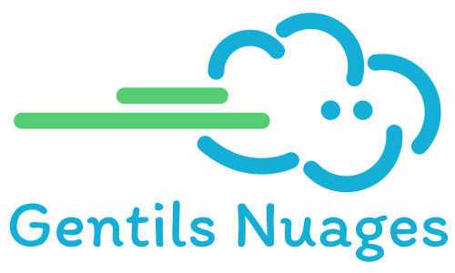
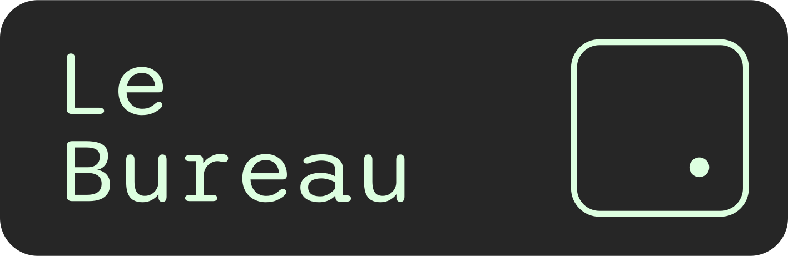
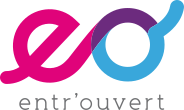

# Welcome to Biarritz for PyConFR 2026!

## Welcome to Biarritz for PyConFR 2026!

- Welcome all!
- Slides in English, talk in French

## Thanks to ESTIA

Thanks to them to welcome us here

## AFPy

- French Python Association, promoting Python langaugage to all users

## AFPy projects

- Genepy ([genepy.org](https://genepy.org)), exercises platform to learn Python
- Forgejo instance for open Python projects ([git.afpy.org](https://git.afpy.org))
- French translation of Python documentation

## Meet AFPy

- Our Discourse forum ([discuss.afpy.org](https://discuss.afpy.org)) to have async discussion with French Python community
- Our Discord channels ([afpy.org/discord](https://afpy.org/discord)) for instant talks
    - **Discord is the main tool for the team to communicate during the event**

---

- AFPy meetups in several cities: Bordeaux, Grenoble, Lyon, Paris and others
- Other French communities: Cameroun, Congo Brazzaville, Niger, Togo

## Partnerships

- Special thanks to

- that provide us mails, domain names, servers and graphics

# PyConFR 2026

## Rules

- Please do not eat/drink in the rooms
- The code of conduct of the AFPy applies **during the whole event (including Saturday dinner)**
    - Be nice and respectful to everyone
    - Full version of the CoC can be found on [pycon.fr](https://pycon.fr)

- You can contact the diversity team directly by email ([diversite@afpy.org](mailto:diversite@afpy.org)) or phone () for any issue you may encounter

## Video recording

- Thanks to Raffut for the video recording
- Don't disturb or move the recording equipments

## Workshops & talks

- Durations of the slots:
    - Keynote: 55 minutes
    - Short talk: 25 minutes
    - Long talk: 50 minutes
    - Workshop: half a day (2h25)
- **Respect the duration** so we won't be late
- These durations include questions time, if any (up to the speaker)

## How to ask questions?

- A question ends with a "?", remarks are not questions
- A question does not start with "it's not really a question, but"
- Don't interrupt the talk for your question if the speaker didn't say it's ok

## Lightning talks

- Very short talks (5 to 10 mintes) on free subjects, with or without slides
- Lightning talks take place **tomorrow from 11 to 13 in LANG6 room**
- We have a sheet in the lobby to register your subjects

# Thanks to our great sponsors

## ESTIA

## Mergify

## Dynapps

## Entr'ouvert

## Alma

## Thanks to all sponsors

# Practical information

## Meals

- Breakfast served today & tomorrow thanks to XXX
- We have 2 foodtrucks for lunchs:
   - Voyage culinaire: Local French food
   - El Güero: Mexican tacos

## Saturday dinner

- For people who booked the option
- Let's meet at the SPOT at 19:30
    - 500m from the campus
    - Voie Technopole Izarbel, 64210 Bidart

## AFPy's general meeting

- Takes place **tomorrow at 9** in **PATUEK** room
- Opened to everyone but only AFPy members can vote

## Call for volunteers

- We always need people to help, coordinate talks and welcome visitors
    - Especially tomorrow morning during the general meeting
- Come talk to us if you want to volunteer

## Practical information

- Wifi network: ESTIA – VISITEURS
    - Then use your email address to login
- Opening hours:
    - Until 18 today
    - From 8:30 to 17 tomorrow

## Thank you all!
